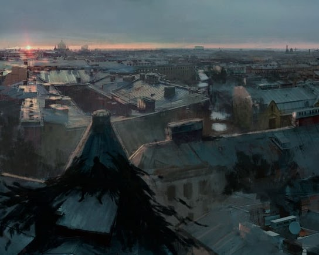
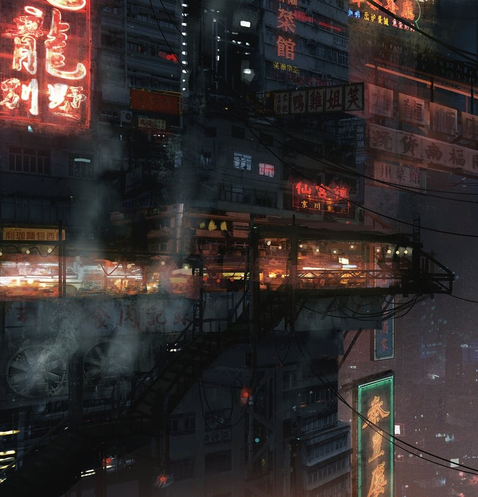
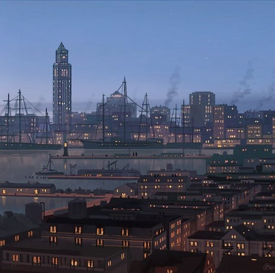
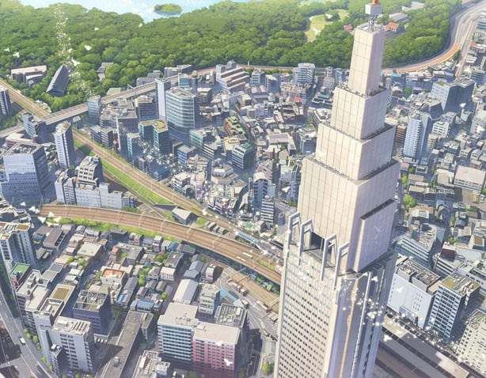
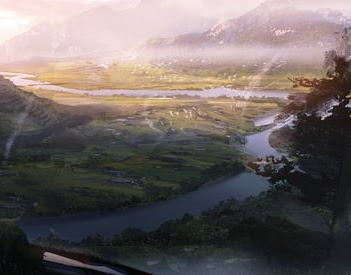
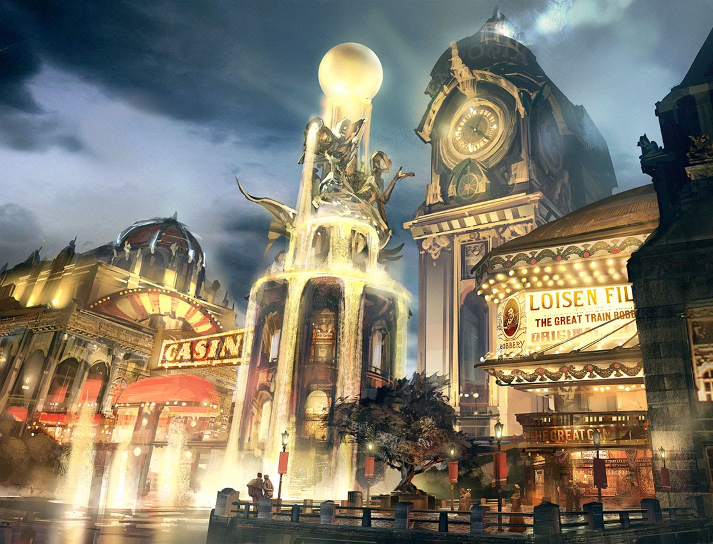

# Persepolis


 
**Type:** Dhruva  
**State:** Auctioned  
**Relevance:** Season 1, Season 2  
**Overview:** One of the many Dhruva type cities that used to make a living by renting out their space to other cities, be it for Holy Grail Wars or other purposes. Republic's research labs used to conduct S.E.R.V.A.N.T. frame trial runs here during the early days of its development as well.

Persepolis went into decline in recent years due to rental requests being scarce, and its Aristocrat and Mafia factions waged their own Holy Grail War over the ownership of the city **(Season 1)**. In the end, the Grail turned out to be fake and blew up its major leylines. Its citizens had to evacuate to other cities as a result.

Currently, two Cynosura type cities are holding a tournament over Persepolis' ownership. **(Season 2)**.

**Character Help:** Characters from Persepolis are aware that the Aristocrats and the Mafia goofed up and blew up the city, which is why they had to evacuate in the first place.


# Olympia


 City Map
**Type:** Cynosura  
**State:** Operational  
**Relevance:** Season 2  
**Overview:** A Church-affiliated, heavily industrilized city that makes a living on the manufacturing and exportation of various goods. Factories are Olympia’s lifeline; some of them far exceed the scale and capability of standard factories in other lesser cities. It wouldn’t be a stretch to say that there is nothing Olympia cannot mass-produce.

Olympia gives priority to fulfilling orders that directly come from the Neo Holy Empire. It likely holds several valuable blueprints frequently used by the Church staff. As such, the Church often stations their agents within the city under the name of protection.

In Olympia, one’s social standing is dictated entirely by their lineage. The aristocracy monopolizes the factories and, by extension, the factory workers. The average citizen is able to lead a comfortable life in Olympia so long as they abide by the law and work hard. However, they have no say in political matters.

Currently, Olympia is in the middle of a bidding war over Persepolis’ corpse. Since the city itself lacks no resources, its ruling class is doing so entirely as a display of wealth and power.

**Character Help:** Characters from Olympia are loyal to, or at least aware of the influence of the Church within their city. They are aware that a certain Saber from the CGW in Season 2 almost took over the city, and that the CGW resulted in a loss for Olympia.


# Delphi


 City Map
**Type:** Cynosura  
**State:** Operational  
**Relevance:** Season 2  
**Overview:** An independent trade center that actively involves itself in intercity business around the globe. Trading, sharesholding, consultation, investment, so long as there’s profit, Delphi won’t ever turn down an offer.

Delphi’s social hierarchy could be described as ‘lawless’. Within the city, it’s every man for themselves…but only in a business sense. Anyone is allowed to open up their own firm, and anyone is allowed to crush their competitors, so long as it’s within legal confines. As a result, one’s political standing in Delphi is almost always tied to the success of their business.

As such, Delphi’s ruling class changes annually. Only those who are competent, or lucky enough to make it in have the right to make major decisions for the city.

Currently, Delphi is in the middle of a bidding war over Persepolis’ corpse. It wishes to use the extra resources to expand itself into a Stella Maris grade city. With its economical prowesss, it’s extremely confident on winning the bid.

**Character Help:** Characters from Delphi are aware of their victory in the CGW in Season 2, and that Delphi is currently using the resources from Persepolis to expand their territory. In a few years, Delphi would grow into a full-fledged Stella Maris.


# Alexandria


 City Map
**Type:** Stella Maris  
**State:** Operational  
**Relevance:** Season 1, Season 4  
**Overview:** Also known as the New World's Archive, Alexandria is a megalopolis that aims to recover and preserve every piece of data from both the Old and the New World. It houses the world's largest, most up-to-date database, as well as public libraries, museums and warehouses full of books and artifacts that are available for rental.

Alexandria's only goal is to archive human history. It does not meddle in political affairs, nor does it seek to use its information network for monetary gains. As such, it manages to maintain an amicable relationship with most major factions, especially those who are open to information exchange.

Aside from Alexandria, multiple smaller-scale library cities also exist as its subsidiary. Some of them report directly to Alexandria, while others choose to work for other cities or factions. Those that do not work directly under Alexandria usually do not have the authorization to access more classified data.


# Nirvana


 City Map
**Type:** Cynosura  
**State:** Operational  
**Relevance:** Season 3  
**Overview:** Nirvana is a nature reserve city. It is run by independent investors that are attempting to set roots in the New World, a groundbreaking concept that could potentially lead to humanity living on land once again instead of relying on nomadic cities. While this is Nirvana's primary objective, it also doubles its purpose as a tourist spot by hosting various rare animal species that have survived the apocalypse. It is very similar to a wildlife park or zoo.

A slew of tragedies hit the city in recent years, resulting in the city cutting off communication with the rest of the world. Further investigations revealed that the city, in its mad attempt at setting roots in the flooded world, had brought the Grail Mud onto the surface of the New World.

As of March 2105, the City is currently under quarantine, with further measures to be taken against its land and inhabitants...as soon as the rest of the world catches up with the devastating news, that is.


# Shangri-La



**Type:** Polaris  
**State:** Operational  
**Relevance:** Rest of the World  
**Overview:** Shangri-La may be within the Polaris classification, but it stands alone on its own echelon. The name alone holds gravitas among those who speak it. It’s in the fantasies of the common folk who heard of it. The upper class brags about spending time there. That’s the kind of power a ticket to Shangri-La holds despite the city’s size. (Shangri-La sits in between classifications due to the size of it, reaching around a quarter of a Dhruva-sized Nomadic city, or one arm, leaving it too large to simply be considered just a Polaris class but still too small to be a Dhruva class.)

Shangri-La makes trips around the world visiting various Stella Maris cities, and even some select Cynosura cities as well, to drop off occupants and pick up new ones. Although, docking with other cities isn’t the only way people get on and off of Shangri-La. In some cases, other ships, known as “Boats of Paradise”, exist to provide Shangri-La with supplies and newcomers from places in-between scheduled docking dates.


